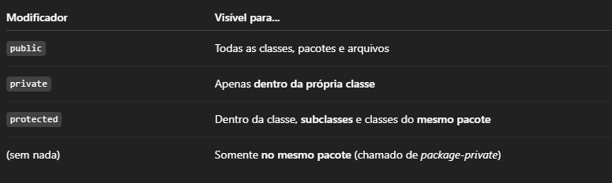

# 📘 Resumo das Anotações
**Curso:** Java: Aplicando a Orientação a Objetos


## 🧱 Classe, Atributos e Instanciação de Objetos

### 📦 Classe

- Uma classe em Java é como um molde para criar objetos.
Ela define as características (atributos) e comportamentos (métodos) que os objetos terão.

### 🧬 Atributos
- Os atributos são as variáveis internas de uma classe. Representam o estado do objeto.

```java
public class Filme {
    String titulo;
    int anoDeLancamento;
}
```

### 🆕 Instanciando um Objeto
 
- Um objeto é criado a partir da classe usando o operador new.

```java
Filme meuFilme = new Filme();
meuFilme.titulo = "Matrix";
meuFilme.anoDeLancamento = 1999;
```

- Após instanciar, podemos acessar e modificar os atributos com . (ponto).

---

## 🛠️ Métodos em Java
 - Métodos são blocos de código que representam comportamentos de uma classe.

 - São usados para executar ações, manipular atributos ou retornar valores.

### 📌 Estrutura de um método:

```java
public void exibirFichaTecnica() {
    System.out.println("Título: " + titulo);
    System.out.println("Ano: " + anoDeLancamento);
}
```

### 🔑 Componentes de um método:

- public: modificador de acesso
- void: tipo de retorno (void = sem retorno)
- exibirFichaTecnica: nome do método
- () parênteses: indicam que é um método e podem receber parâmetros

### ✅ Chamando um método:

```java
meuFilme.exibirFichaTecnica();
```

### 🧠 Observações:
- Métodos podem receber parâmetros e retornar valores.
- Exemplo com retorno:

```java
public int obterAno() {
    return anoDeLancamento;
}
```
---

## 🔒 Modificador private e Métodos Acessores (get/set)

### 🔐 private

- O modificador private restringe o acesso de um atributo ou método apenas dentro da própria classe.

- Isso faz parte do princípio de encapsulamento, protegendo os dados internos do objeto.

```java
public class Filme {
    private String titulo;
    private int anoDeLancamento;
}
```

### 📥 Método get

- Usado para acessar (ler) o valor de um atributo private.

```java
public String getTitulo() {
    return titulo;
}
```

### 📤 Método set

- Usado para alterar (escrever) o valor de um atributo private.

```java
public void setTitulo(String novoTitulo) {
    this.titulo = novoTitulo;
}
```
### ✅ Exemplo de uso:

```java
Filme filme = new Filme();
filme.setTitulo("Matrix");
System.out.println(filme.getTitulo());  // Saída: Matrix
```

---

## 🛡️ Modificadores de Acesso em Java

- Os modificadores de acesso definem o nível de visibilidade de classes, atributos e métodos para outras partes do código.

    

### ✅ Exemplos:
```java
public class Pessoa {
    private String nome;           // Visível apenas dentro da classe
    protected int idade;           // Visível no mesmo pacote e subclasses
    String cidade;                 // (package-private) visível no mesmo pacote
    public String nacionalidade;   // Visível em qualquer lugar
}
```

---

## 📦 Pacotes em Java e Convenções de Nomenclatura

### 🗂️ O que são pacotes?

- Pacotes (packages) são usados para organizar classes em grupos lógicos.
- Facilitam a manutenção do código e evitam conflitos de nomes.
- Um pacote é representado por uma estrutura de diretórios no projeto.

### 🧾 Como declarar um pacote:

- A declaração deve ser a primeira linha do arquivo .java:

```java
package br.com.guilherme.minhaplicacao;
```

- Isso indica que a classe pertence ao pacote br.com.guilherme.minhaplicacao.

## ✍️ Convenções de Nomenclatura para Pacotes e Classes

### 📌 Pacotes:

- Usam letras minúsculas.
- Costumam seguir o padrão do domínio invertido da empresa.

- Exemplos:
  - com.alura.loja
  - br.com.guilherme.minhaplicacao

### 📌 Classes:

- Nome com inicial maiúscula, estilo CamelCase.
- Exemplo: Filme, PessoaFisica, CalculadoraFinanceira

---

## 🧱 Encapsulamento em Java

- Encapsulamento é o princípio de esconder os detalhes internos de uma classe e expor apenas o necessário para uso externo.
- Ele protege os dados e melhora a manutenção e segurança do código.

### ✅ Como aplicar encapsulamento:

- Tornar os atributos private.
- Fornecer métodos public de acesso (get) e modificação (set).

## 📌 Exemplo:

```java
public class Conta {
private double saldo;

    public double getSaldo() {
        return saldo;
    }

    public void setSaldo(double novoSaldo) {
        if (novoSaldo > 0) {
            this.saldo = novoSaldo;
        }
    }
}
```

### 🔒 Benefícios:

- Impede acesso direto e indesejado aos atributos.
- Permite aplicar regras de negócio (ex: validações) nos métodos set.
- Ajuda a manter o controle sobre o estado interno do objeto.

---

## 🧬 Herança em Java

### 📌 O que é?

- Herança permite que uma classe (subclasse) herde atributos e métodos de outra classe (superclasse).
- Promove reutilização de código e facilita a especialização de comportamento.

### 🧱 Sintaxe:

```java
public class Animal {
    String nome;

    public void emitirSom() {
        System.out.println("Som genérico");
    }
}

public class Cachorro extends Animal {
  public void abanarRabo() {
    System.out.println("Abanando o rabo");
  }
}
```
- Cachorro herda o atributo nome e o método emitirSom() de Animal.

### 🔁 Comportamento:

- A subclasse pode:

    - Usar atributos e métodos da superclasse diretamente.
    - Sobrescrever métodos com @Override (como você já aprendeu).
    - Adicionar novos comportamentos.

### 🔒 Controle de acesso:

- Apenas os membros public e protected da superclasse são acessíveis pela subclasse.
- Membros private não são herdados diretamente.

### ☝️ Palavra-chave super

- Usada para acessar membros da superclasse (atributos ou métodos):

```java
super.emitirSom(); // chama o método da superclasse
```

---

## 🔁 Override em Java

### 📌 O que é?

- Override significa sobrescrever um método de uma classe pai (superclasse) em uma classe filha (subclasse).
- Usado para alterar o comportamento herdado.

### ✅ Regras para sobrescrever:

- O método da subclasse deve ter:
  - Mesma assinatura (nome + parâmetros)
  - Mesmo tipo de retorno (ou um mais específico)
  - Mesmo ou acesso mais permissivo (ex: public não pode virar private)
- Usar a anotação @Override (boa prática — o compilador verifica se você está realmente sobrescrevendo).

### 🧱 Exemplo:

```java
public class Animal {
    public void emitirSom() {
        System.out.println("Som genérico de animal");
    }
}

public class Cachorro extends Animal {
    @Override
    public void emitirSom() {
        System.out.println("Latido");
    }
}
```

### ▶️ Uso:

```java
Animal meuAnimal = new Cachorro();
meuAnimal.emitirSom();  // Saída: Latido
```

- Mesmo a variável sendo do tipo Animal, o método sobrescrito em Cachorro será chamado — isso é polimorfismo.

---

## 🔄 Sobrecarga de Métodos (Overload)

### 📌 O que é?

- A sobrecarga (overload) permite criar vários métodos com o mesmo nome, desde que tenham assinaturas diferentes (quantidade ou tipo de parâmetros).
- Não depende do tipo de retorno!

### 🧱 Exemplo:

```java
  public class Calculadora {
    public int somar(int a, int b) {
    return a + b;
  }

  public double somar(double a, double b) {
      return a + b;
  }
  
  public int somar(int a, int b, int c) {
      return a + b + c;
  }
}
```

- Todos os métodos acima se chamam somar, mas têm assinaturas diferentes, portanto são válidos.

### ✅ Vantagens:

- Aumenta a flexibilidade e a legibilidade.
- Ajuda a criar interfaces amigáveis ao desenvolvedor.

--- 

## 🧱 Design de Classes

### 🎯 Boas práticas:

- Uma classe deve representar uma responsabilidade clara.
- Deve ser coesa: todos os atributos e métodos devem estar relacionados com o papel da classe.
- Evite acoplamento excessivo com outras classes.
- Crie métodos pequenos e de responsabilidade única.

### 📐 Convenções e Organização:

- Nome da classe: substantivo singular, com a primeira letra maiúscula.
- Cada classe em seu próprio arquivo .java.
- Use encapsulamento: private para atributos + get/set quando necessário.
- Construtores personalizados para garantir consistência do objeto.

## 🧠 Exemplo de design limpo:

```java
public class Produto {
    private String nome;
    private double preco;

    public Produto(String nome, double preco) {
        this.nome = nome;
        this.preco = preco;
    }

    public double aplicarDesconto(double percentual) {
        return preco - (preco * percentual);
    }
    // gets e sets omitidos por simplicidade
}
```

---

## 🌀 Polimorfismo em Java

### 📌 O que é?

- Polimorfismo significa "muitas formas".
- Permite que objetos de diferentes classes sejam tratados como se fossem do mesmo tipo, normalmente o tipo da superclasse.
- Funciona com métodos sobrescritos (@Override) e permite substituir comportamentos em tempo de execução.

### 🧠 Exemplo básico:

```java
  public class Animal {
    public void emitirSom() {
    System.out.println("Som genérico");
    }
  }

  public class Gato extends Animal {
    @Override
    public void emitirSom() {
    System.out.println("Miau");
    }
  }

  public class Cachorro extends Animal {
    @Override
    public void emitirSom() {
    System.out.println("Au au");
    }
  }
```
### ▶️ Usando polimorfismo:

```java
Animal meuAnimal = new Gato();
meuAnimal.emitirSom(); // Saída: Miau

meuAnimal = new Cachorro();
meuAnimal.emitirSom(); // Saída: Au au
```

- Mesmo declarada como Animal, a variável executa o método correto da subclasse (Gato, Cachorro) — isso é polimorfismo!

### 🔄 Polimorfismo x Sobrecarga

- Polimorfismo: usa herança + sobrescrita (@Override)
- Sobrecarga: métodos com o mesmo nome, mas diferentes assinaturas (número/tipo de parâmetros)

---

🔐 Modificador protected

### 📌 O que é?

- O modificador protected torna um atributo ou método visível:
- Na própria classe
- Nas subclasses (mesmo em pacotes diferentes)
- Em outras classes do mesmo pacote

### 🔍 Comparação rápida

| Modificador | Mesma Classe | Mesmo Pacote | Subclasse (outro pacote) | Fora da hierarquia |
|-------------|--------------|--------------|---------------------------|---------------------|
| `private`   | ✅           | ❌           | ❌                        | ❌                  |
| *(default)* | ✅           | ✅           | ❌                        | ❌                  |
| `protected` | ✅           | ✅           | ✅                        | ❌                  |
| `public`    | ✅           | ✅           | ✅                        | ✅                  |


### 🧱 Exemplo:

```java
public class Animal {
    protected String especie;

    protected void dormir() {
        System.out.println("Animal dormindo");
    }
}

public class Gato extends Animal {
    public void mostrarEspecie() {
      System.out.println(this.especie); // permitido
      this.dormir(); // permitido
    }
}

```

- Atributos e métodos protected são acessíveis em subclasses, mesmo que estejam em pacotes diferentes, o que os torna úteis para herança sem expor tudo publicamente.